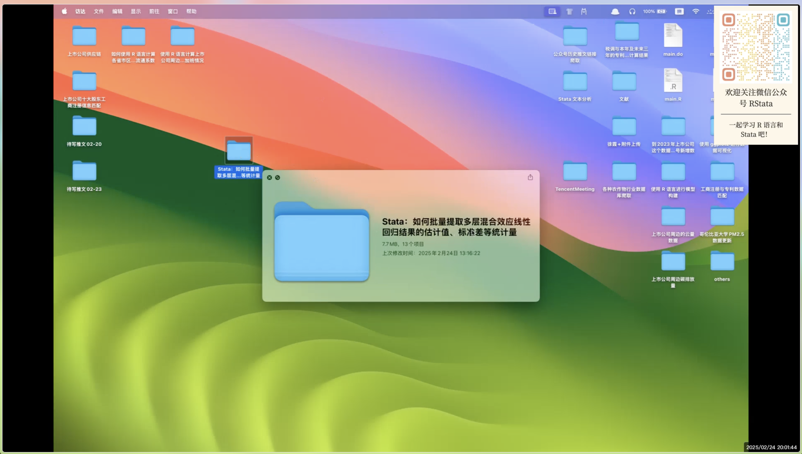

mp4handel: 自动给视频添加水印及生成前 20 分钟的预览视频

<!-- badges: start -->

[](https://www.tidyverse.org/lifecycle/#experimental)
<!-- badges: end -->

自用 Stata 命令，不一定能在大家的电脑上运行，不过代码还是很值得参考的！

里面调用了 ffmpeg，使用前需要安装：

```shell
# MacOS
brew install ffmpeg 
```

欢迎大家关注微信公众号“RStata” 和 “Stata 中文社区” 获取最新资讯和动态！

| RStata | Stata中文社区 |
|:--:|:--:|
|  |  |

这篇文档用以测试在 Markdown 文件中插入 Stata
代码，然后进行编译。编译过程中会自动执行代码、保存代码输出结果、保存图片，然后再把结果和图片插入到文档中。不过在这个过程中也要遵循一些基本规则。

```stata
mp4handel "Stata：如何批量提取多层混合效应线性回归结果的估计值、标准差等统计量.mp4"

*> Stata：如何批量提取多层混合效应线性回归结果的估计值、标准差等统计量
*> RStata 培训班试听课，更多内容欢迎报名 RStata 培训班学习，然后课程学习中遇到的问题都可以随时提问～
```



